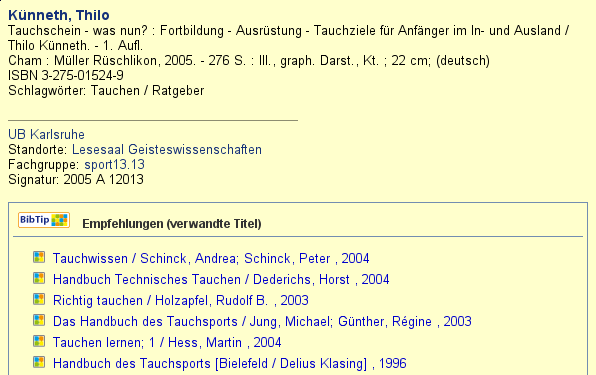
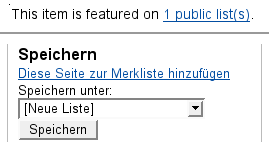

% Empfehlungsdienste
% Jakob Voß
% Mai 2009

# Einleitung

Empfehlungsdienste (engl. "recommender/recommendation systems") weisen Nutzer
gezielt auf Titel oder andere Informationen hin, die für sie relevant sein
könnten. Da die Empfehlungen vom jeweiligen Kontext abhängen, werden sie nicht
fest in die Titeldaten des Katalogs eingetragen, sondern **zur
Kataloganreicherung** dynamisch erstellt und angezeigt. Vor allem im E‑Commerce
sind inzwischen Empfehlungsdienste Standard, bei denen Empfehlungen mit Hilfe
statistischen Verfahren aus Titel- und Nutzerdaten automatisch erzeugt werden.

# Formen von Empfehlungsdiensten

Hinsichtlich ihrer Funktionsweise lassen sich grundsätzlich vier Formen von
Empfehlungsdiensten unterscheiden:

**Explizite Empfehlungsdienste**

liefern **von Menschen zusammengestellte** Empfehlungen in Form von
Bewertungen, Rezensionen, Rankings, Kommentaren, Literaturlisten und
Neuerscheinungslisten etc. Diese stammen in zunehmendem Maße als "user
generated content" von Personen mit gleichen Interessen und
Informationsbedürfnissen, während die Bibliothek eher vermittelnd auftritt.

**Inhaltsbasierte Empfehlungsdienste**

versuchen relevante Dokumente mit herkömmlichen Verfahren des
Information-Retrieval (bekannt als "**Suchmaschinentechnologie**") zu
bestimmen. Beispielsweise kann basierend auf Volltexten die Ähnlichkeit von
Dokumenten berechnet werden, um ausgehend von einem Dokument verwandte Titel zu
empfehlen. Auch die gerankte Trefferliste einer Suchmaschine als Antwort an
eine Suchanfrage kann als Empfehlungsliste aufgefasst werden;  hieran wird
deutlich, dass die normale Trefferliste eines OPACs nur eine von mehreren
Quellen zur Ermittlung relevanter Literatur ist.

**Regel- und wissensbasierte Empfehlungsdienste**

basieren auf einfachen Wenn-Dann-Regeln oder komplex­eren funktionalen
Zusammenhängen. Beispielsweise kann bestimmt werden, dass zu einem Dokument
genau die Titel empfohlen werden sollen, die in Form von Zitation oder
Rezension auf das Dokument verweisen. Je nach Komplexität der Regeln wird
gelegentlich auch von "**semantischen**" oder "**intelligenten**" Diensten
gesprochen. Falls -- wie Burke (2000) vorschlägt -- anhand verschiedener
Eigenschaften indexierter Objekte zusätzliche Browsing-Möglichkeiten angeboten
werden, verschwimmen die Grenzen zu inhaltsbasierten Empfehlungsdiensten wie
zum Beispiel dem facettierten Browsing (auch "Drill-Down").

**Verhaltensbasierte Empfehlungsdienste**

werten mit statistischen Methoden des Data-Mining das Verhalten von
Nutzern aus und ermitteln aus darin erkannten Mustern Empfehlungen.
Ausgangspunkt ist ein möglichst großer Datenbestand an Seitenaufrufen,
Ausleihdaten oder anderen Verknüpfungen zwischen Nutzern und
Dokumenten. Aus diesen kann die Ähnlichkeit zwischen Nutzern und die
Ähnlichkeit zwischen Dokumenten berechnet werden. Die Verfahren werden
auch als Kollaboratives Filtern ("**collaborative filtering**") bezeichnet.
Bekannt sind beispielsweise die auf dem Kaufverhalten basierenden
Empfehlungen "Kunden, die diesen Artikel gekauft haben, kauften auch ..."
beim Online-Buchhändler Amazon. Wichtig ist bei verhaltensbasierten
Verfahren, dass Nutzer­daten nur anonymisiert verarbeitet und nicht ohne
Einwilligung weitergegeben werden.

Als "Recommender Systems" im engeren Sinne werden nach @Resnick1997 vor allem
solche Dienste verstan­den, bei denen Nutzer Bewertungen abgeben können, aus
denen anschließend Empfehlungen für andere Nutzer berechnet werden. Wie die
Übersicht der vier Formen von Empfehlungsdiensten zeigt, können Empfehlungen
jedoch mit unterschiedlichen Verfahren aus verschiedenen Quellen ermittelt
werden, wobei jedes Verfahren seine Vor- und Nachteile hat. Vermehrt werden
deshalb auch hybride Systeme eingesetzt, die mehrere Verfahren kombinieren.

# Entwicklung und Bestandteile

Zur Planung und Entwicklung eines Empfehlungsdienstes und seines Einsatz ist es
hilfreich, seine vier aufeinander aufbauenden **Komponenten** zu betrachten:
ausgehend von einer Daten­grundlage (1) werden mit einem Verfahren (2)
Empfehlungen erzeugt, über einen Dienst (3) zur Verfügung gestellt in eine
Anwendung (4) eingebunden (Abb. 1).

Zunächst ist zu klären, welche Daten zur Ermittlung von Empfehlungen überhaupt
zur Verfügung stehen. Neben dem eigenen Bibliotheksbestand in Form von
Katalogeinträgen und Volltexten kommen zur Auswertung Nutzungsdaten wie
Seitenaufrufe und Ausleihen in Frage. Zusätzlich kann Nutzern die Möglichkeit
gegeben werden, Kommentare, Rezensionen und Bewertungen abzugeben, Literatur in
persönlichen Listen zusammenzustellen, und mit eigenen Schlagworten (Tags) und
Bewertungen zu versehen. Auch externe Quellen wie Rezensionsdienste und
Zitationsdatenbanken kommen als Datengrundlage in Frage.

    (1) Datengrundlage
    (2) Verfahren
    (3) Dienst
    (4) Anwendung

Abb. 1: Bestandteile eines Empfehlungsdienstes

Die Entwicklung von Verfahren für Empfehlungsdienste ist spätestens seit den
1990er Jahren ein aktives Forschungs­gebiet. Neue Verfahren werden unter
Anderem auf der jährlich durchgeführte Text Retrieval Conference
(**TREC**)[^TREC] und auf der ACM Recommender Systems
Konferenz[^<http://recsys.acm.org>, jährlich seit 2007] evaluiert; im Bereich
des Kollaborativen Filterns diente lange der mit 1.000.000 \$ dotierte
**Netflix Prize** als Messlatte.[^Netflix] Bei der Entwicklung eigener
Empfehlungs­dienste sollte die aktuelle Forschungsliteratur konsultiert werden.
Anstatt die Auswertung und Weiterverarbeitung der Datenrundlage zu Empfehlungen
von Grund auf selber zu implementieren, kann diese Komponente auch in Auftrag
gegeben oder als fertige Softwarebibliothek eingesetzte werden -- allerdings
sollte beim Einsatz fremder Systeme zumindest klar sein, auf Grundlage welcher
Daten und mit welchen konkreten Algorithmen Empfehlungen ermittelt werden. Für
inhaltsbasierte Verfahren genügt oft bereits eine gezielte Indexierung mit
einer leistungsfähigen Suchmaschine wie Apache Lucene[^Lucene] während für
verhaltensbasierte Empfehlungen noch etwas mehr Eigenarbeit notwendig
ist.[^Mahout]

Viele Bibliothekssysteme bestehen noch immer aus monolithischen
Softwareprodukten, die nur schwer erweitert oder an eigene Bedürfnisse
angepasst werden können. So lassen sich Neuerungen und Änderungen nur schwer
umsetzen. Eine Strategie gegen dieses Innovationshemmnis ist es, einzelne
Funktionalitäten voneinander abzukoppelt und als unabhängige Dienste
("Services") anzubieten. Über offen standardisierte Schnittstellen können
Dienste anschließend flexibel miteinander kombiniert werden.^[Beispielsweise
können Empfehlungen zusätzlich als RSS-Feed bereitgestellt und über einen
Benachrichtigungsdienst verschicket werden.] Im Zuge der Web 2.0-Bewegung ist
dieses Prinzip auch als "**Mashup**" bekannt. Um Empfehlungsdienste einfach in
die bestehende und zukünftige Infrastruktur einzubinden, ist es ratsam, die
Empfehlungen über eine API als standardisierten Dienst anzubieten, dessen
 Anwendung nicht auf eine bestimmte Katalogoberfläche beschränkt ist.

Die zur Verfügung gestellten Empfehlungen können schließlich in verschiedene
Anwendungen eingebunden werden. In erster Linie sind dies Bibliothekskataloge,
aber auch andere Portale, E-Learning-Plattformen und weitere
Benutzeroberflächen zur Präsentation und Recherche von Literatur kommen in
Frage. In welcher Form dem Nutzer Empfehlungen präsentiert werden, liegt
letztendlich in der **Entscheidung des verantwortlichen Bibliothekars**. Umso
wichtiger ist es, dass zum Experimentieren mit verschiedenen Diensten und
Darstellungen geeignete Werkzeuge zur Verfügung stehen. Zeitgemäßen
Weboberflächen sollten deshalb über eine Template-Syntax zur Trennung von
Funktionalität und Layout verfügen, die zur Umgestaltung der Benutzeroberfläche
lediglich einige Kenntnisse in HTML und CSS voraussetzt. Neben Anwendungen, die
von Nutzern gezielt aufgesucht werden müssen, kann auch der Einsatz von
Empfehlungsdiensten in Push-Medien (z.B. Mail, SMS oder Benachrichtigung durch
mobile Apps) sinnvoll sein.


# Beispiele

Die folgenden Beispiele sollen einen kleinen **Einblick in die Vielfältigkeit**
von Empfehlungsdiensten und ihren Einsatz in der Praxis geben. Vorgestellt
werden erstens ein verhaltensbasierter Dienst auf Grundlage von Seitenaufrufen,
zweitens eine explizite Form von Empfehlungen,  die gleichzeitig als Grundlage
für weitere Verfahren dienen kann, drittens ein inhaltsbasierter Dienst zur
Empfehlung von Suchanfragen und viertens ein Verfahren zur Bereitstellung und
Katalogeinbindung von Empfehlungen über eine Webschnittstelle.

## BibTip

Das verhaltensbasierte Recommendersystem BibTip wurde ab 2002 im Rahmen von
DFG-Projekten an der Universität Karlsruhe entwickelt.[^BibTip] Inzwischen wird
es finanziert durch Nutzungsgebühren in mehreren Katalogen eingesetzt. Zum
Einbinden in den eigenen Katalog reichen wenige Zeilen HTML und JavaScript. Die
Empfehlungen basieren auf der anonymisierten **Auswertung des
Nutzerverhaltens**: aus den aufgerufenen Titelanzeigen werden automatisch
zusammengehörige Sitzungen ermittelt, die als ein Waren­korb von Titeln
aufgefasst werden. Anhand der statistischen Auswertung sich überschneidender
Warenkörbe können nach einer Anlaufzeit zu einem Titel weitere Titel empfohlen
werden, die häufig zusammen aufgerufen wurden (Abb. 2).^[Eine genauere
Beschreibung des Algorithmus findet sich bei @GeyerSchulz2003.]



## Persönliche Literaturlisten

Persönliche Literaturlisten dienen Nutzern dazu, für ihre Zwecke
Literaturangaben aus Katalogen zusammenstellen. Während
Literaturverwaltungsprogramme wie EndNote und Zotero über Schnittstellen auf
den Katalog zugreifen,^[Standard war bisher Z39.50, welches möglicherweise
durch SRU/SRW abgelöst wird. Zur Übernahme einzelner Titeldatensätze ist unAPI
immer populärer.] bieten einige Kataloge auch die direkte Verwaltung von Listen
an (Abb. 3). Darüber hinaus gibt es Webanwendungen wie BibSonomy und
LibraryThing [@Voss2007] zur gemeinschaftlichen Literaturverwaltung (**Social
Cataloging**): Verweise auf die gleichen Bücher, Artikel oder andere
Publi­kationen werden dabei miteinander verknüpft, so dass innerhalb des
Systems ersichtlich ist, welche Benutzer eine bestimmte Publikation in ihrer
Sammlung haben.



Persönlichen Listen können auf verschiedene Weise als Grundlage für
Empfehlungen dienen. Zunächst einmal handelt es sich um explizite Empfehlungen:
Trägt jemand einen Titel in eine Liste ein, so besitzt der Titel
offen­sichtlich eine gewisse Relevanz. Ausgehend vom Titel sollte auf seine
Eintragung in Listen hingewiesen werden, so dass andere Nutzer zu Listen und
von da aus zu weiteren Titeln gelangen (Abb. 3). Weitere Empfehlungen können
verhal­tensbasiert aus Überschneidungen von Listen berechnet werden (Abb. 4).
Existieren Verknüpfungen zwischen Titeln im Katalog und Titel in persönlichen
Literaturlisten, können Empfehlungen auch aus externen Systemen eingebunden
werden, wie zum Beispiel mit **LibraryThing for Libraries**.[^LibraryThing]


Die Erstellung von Literaturlisten ist nicht auf Nutzer beschränkt, auch
bibliothekarische Empfehlungslisten,  Fachbibliographien, Semesterapparate u.Ä.
können qualitative Empfehlungen liefern -- dazu müssen sie jedoch über
Empfehlungsdienste in den Katalog integriert werden. Weitere Informationen
können Rezensionen, Kommentare und Bewertungen liefern, mit denen Nutzer in
einigen Systemen die Titeln ihrer Listen anreichern können.

## Eingabe-Korrektur

Nach Eingabe von Suchanfragen, die in anderer Schreibweise deutlich mehr
Treffer erzielen würde, weist Google mit der Einleitung "Meinten Sie:" auf die
gebräuchlichere Suchanfrage hin (Abb. 5).[^GoogleHilfe] Obgleich diese Funktion
auch als Rechtschreibkorrektur bekannt ist und für diesen Zweck eingesetzt
werden kann, ist die Grundidee eine andere: Der Nutzer wird nicht auf die
"richtige" Schreibweise hingewiesen, sondern auf eine andere Suchanfrage mit
größerer Treffermenge, die für ihn relevant sein könnte.


Abb. 5: Eingabe-Korrektur bei Google

Eine weitere inhaltsbasierte Empfehlung bietet Google übrigens mit dem Link
"Ähnliche Seiten" an (unten rechts).

## Empfehlungs-Einbindung mit SeeAlso

SeeAlso ist kein konkreter Dienst, sondern ein an der Verbund­zentrale des GBV
(VZG) entwickeltes Verfahren zur kontextbezogenen Einbindung von **Links in
Webseiten**.^[Siehe <http://ws.gbv.de/seealso/> und die dort verlinkten Seiten]
Ein Empfehlungsdienst kann über die standardisierte SeeAlso-API Empfehlungen
auf Abruf bereitstellen. Im Katalog (oder einer beliebigen anderen Webseite)
genügt nach Einbindung einer Client-Bibliothek ein einfacher Aufruf, damit der
Empfehlungsdienst abgefragt und die ermittelten Empfehlungen auf der Webseite
angezeigt werden. Verschiedene Empfehlungsdienste können so **flexibel
miteinander kombiniert** werden. Für die Einbindung des SeeAlso-Dienstes
isbn2wikipedia,^[Empfehlungsdienst unter
<http://ws.gbv.de/seealso/isbn2wikipedia>.] der bei Übergabe einer ISBN
regelbasiert Links auf Wikipedia-Artikel liefert, die diese ISBN enthalten,
reichen beispielsweise die folgende Zeilen im HTML-Quelltext:

```
<!-- im HTML head Bereich: -->
<script src="http://ws.gbv.de/seealso/my-seealso.js"
        type="text/javascript"></script>

<!-- irgendwo auf der Webseite: -->
<div title="3-7643-5826-2" class="isbn2wikipedia" />
```

Ob Nutzer ausgehend von einer ISBN auf Wikipedia-Artikel oder auf andere
literaturbezogene Angebote verwiesen werden, spielt für die Art der Einbindung
keine Rolle. Neben externen Informationen bieten sich z.B. Links auf andere
Bibliotheken, die einen Titel besitzen, oder auf andere Ausgaben und
Rezensionen des Werkes an.

# Zusammenfassung

Empfehlungsdienste bieten verschiedene Möglichkeiten, um Kataloge -- oder
andere Präsentationsformen der Bestände einer Bibliothek .. durch gezielte
Verweise auf relevante Titel oder andere Informationen anzureichern. Da die
konkreten Empfehlungen vom Kontext abhängen, werden sie in der Regel nicht fest
in den Katalog eingetragen sondern **dynamisch über Schnittstellen
eingebunden**.

Welche Empfehlungsdienste in der Praxis eingesetzt werden sollten, hängt immer
von den lokalen Begebenheiten ab. Deshalb ist es wichtig, für die eigenen
Nutzer die jeweils passenden und machbaren Verfahren und Dienste auswählen und
entwickeln zu können. Wenn es nicht möglich ist, den eigenen Katalog mit
Empfehlungen und ähnlichen Diensten an die spezifischen Bedürfnisse anzupassen,
sollte darüber nachgedacht werden, ob **der Betrieb des Katalog** nicht gleich
ganz an eine Suchmaschine oder an einen Verbund­katalog wie WorldCat abgegeben
werden kann.

Bei der Auswahl passender Empfehlungsdiensten sollte zunächst überlegt werden,
**welche Arten von Diensten** überhaupt in Frage kommen. Explizite Empfehlungen
können sowohl von Bibliothekaren und Experten aus ausgewählten Fachcommunities
als auch von einfachen Nutzer abgegeben werden. Bibliotheken können ihren
Nutzern die Sammlung, Kommentierung und Bewertung von Literatur in persönlichen
Listen erleichtern oder explizite Empfehlungen aus anderen Quellen einbinden.
Inhaltsbasierte Empfehlungen lassen sich mit Information-Retrieval-Verfahren
aus Metadaten und Volltexten ermitteln; die berechneten Gruppen und
Ähnlichkeiten von Dokumenten basieren auf reine Statistik. Für regel- und
wissensbasierte Empfehlungen werden dagegen ausgewählte Merkmale der Dokumente
herangezogen. Empfehlungen, die ausgehend von Katalogdaten wie zum Beispiel
ISBN oder Sachgruppen ermittelt werden, können sehr spezifische sein und besser
kontrolliert werden, dafür müssen jedoch geeignete Regeln entwickelt und
programmiert werden. Verhaltensbasierte Empfehlungen verwenden schließlich auch
statistischen Verfahren, nur dass als Grundlage nicht die Dokumente sondern
ihre protokollierte Nutzung dient.

Grundsätzlich handelt es sich bei Empfehlungsdiensten im weiteren Sinne weniger
um ein konkretes technisches Verfahren oder ein eigenständiges Produkt sodern
eher um ein **Paradigma beim Angebot von Informationen**. Anstatt den eigenen
Bestand so neutral wie möglich zu beschreiben und darauf zu hoffen, dass
 Nutzer­anfragen auf die Erschließung passen, werden mit Empfehlungen dem
Nutzer gezielt die Inhalte angeboten, die für ihn in seiner aktuellen Situation
am ehesten relevant sein könnten.

# Literaturempfehlungen

* Klahold, André (2009): "Empfehlungssysteme.: Grund­lagen, Konzepte und
  Systeme". Vieweg + Teubner.

* Segaran, Toby (2008): "Kollektive Intelligenz analysieren, programmieren
  & nutzen. O‘Reilly [Handbuch zur technischen Entwicklung eigener
  Empfehlungsdienste]

* Voß, Jakob (2008): "SeeAlso: A Simple Linkserver Protocol". Ariadne
  Issue 57. <http://www.ariadne.ac.uk/issue57/voss/>.

* Dierolf, Uwe; Mönnich, Michael (2006): "Einsatz von Recommendersystemen
  in Bibliotheken". B.I.T.online 1/2006 [Einführung mit Schwerpunkt auf
  BibTip]

* Burke, Robin (2000): "Knowledge-based Recommender Systems". A. Kent
  (Hrsg.): Encyclopedia of Library and Information Systems. Vol. 69,
  Suppl. 32.

Eine Version dieses Artikels erschien in der Loseblattsammlung "Erfolgreiches
Management von Bibliotheken und Informations­einrichtungen" im Verlag Dashöfer
GmbH in Kapitel 9.4.4 und ist als Open Access archiviert unter
<http://hdl.handle.net/10760/13129>.

Dieser Artikel steht unter den Bedingungen der Creative Commons ShareAlike 3.0
License zur Verfügung.

[^TREC]: Text REtrieval Conference (TREC) Home Page <http://trec.nist.gov/>.

[^Netflix]: Netflix Prize Homepage <http://www.netflixprize.com/>.

[^Lucene]: Siehe <http://lucene.apache.org/>. Aufgrund der einfacheren
Handhabung bietet sich der Einsatz von Produkten an, die auf Lucene aufbauen,
wie Solr <http://lucene.apache.org/solr/> oder VuFind <http://www.vufind.org/>.

[^Mahout]: Als Teilprojekt von Lucene wurde im Januar 2008 mit dem Projekt
Mahout <http://lucene.apache.org/mahout/> begonnen, dass unter Anderem eine
Reihe von Algorithmen zum Kollaborativen Filtern enthält.

[^BibTip]: Siehe <http://www.bibtip.org/> sowie @Moennich2008.

[^LibraryThing]: LibraryThing for Libraries <http://www.librarything.com/forlibraries/>.

[^GoogleHilfe]: Hilfe zu Google-Funktionen <http://www.google.de/help/features.html> (Besucht am 31.8.2008).

# Weitere Quellenangaben
